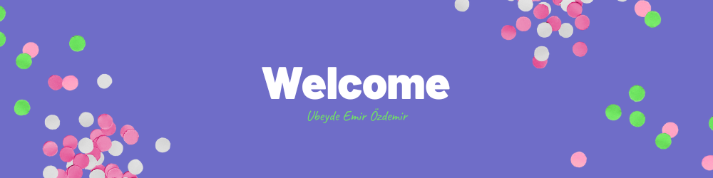

 # 👋 Welcome

Welcome to my GitHub profile! I am Ubeyde. I have been interested in coding since high school years. Now, I am 21 years old and first-year student at Üsküdar University. I'm the average JavaScript enjoyer, currently learning MongoDB.

 ## 🤓 Knowledge & Activity

<!---->

 ## 👀 You can look at...
 
| Project Name | Repo Name | Source Code | Project Link |
| --- | :---: |:---:| :---:|
| **My personal website** | `ubeydeozdmr.github.io` | [Source Code](https://github.com/ubeydeozdmr/ubeydeozdmr.github.io) | [Project Link](https://ubeydeozdmr.netlify.app)
| **Countrypedia** | `countrypedia` | [Source Code](https://github.com/ubeydeozdmr/countrypedia) | [Project Link](https://countrypedia.app)
| **Pokedex Bot** | `pokedex-bot-telegram` | [Source Code](https://github.com/ubeydeozdmr/PokedexBot) | [Project Link](https://t.me/rotompokedex_bot) |
| **Turkiye API** | `turkiye-api` | [Source Code](https://github.com/ubeydeozdmr/turkiye-api) | [Project Link](https://turkiyeapi.cyclic.app) |
| **Crema To-Do** | `vue-todo-app` | [Source Code](https://github.com/ubeydeozdmr/vue-todo-app) | [Project Link](https://crematodo.netlify.app)
| **Movable Arrow** | `movable-arrow` | [Source Code](https://github.com/ubeydeozdmr/movable-arrow) | [Project Link](https://github.com/ubeydeozdmr/movable-arrow/releases/tag/v1.1) |
| **Crema Blog** | `cremablog` | [Source Code](https://github.com/ubeydeozdmr/cremablog) | [Project Link](https://cremablog.cyclic.app) |
<!-- | **Multipurpose Console** | `multipurpose-console` | [Source Code](https://github.com/ubeydeozdmr/multipurpose-console) | [Project Link](https://github.com/ubeydeozdmr/multipurpose-console/releases/tag/2022Edit) | -->
<!--| **Multipurpose Web** | `multipurpose-web` | [Source Code](https://github.com/ubeydeozdmr/multipurpose-web) | [Project Link](https://ubeydeozdmr.github.io/MultipurposeWeb/) |-->

 ## 📫 You can contact me
 

<!--

-->

<!--  -->

<!--

-->
